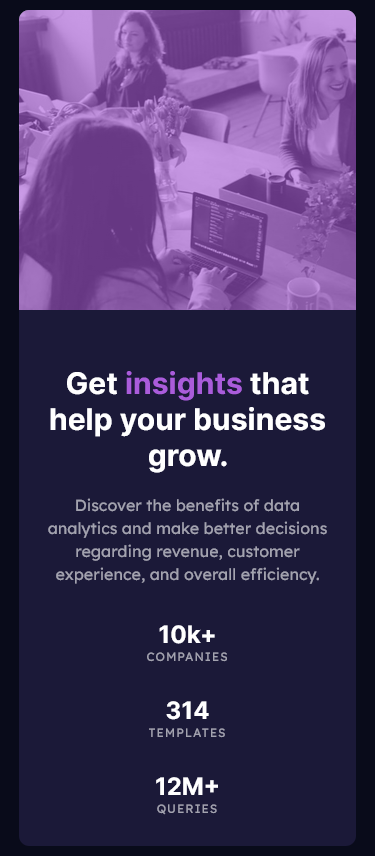
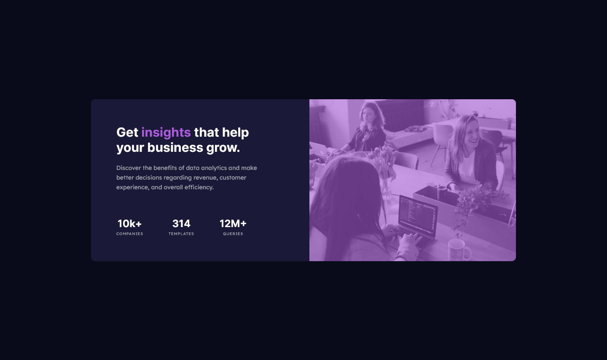

# Frontend Mentor - Stats preview card component solution

This is a solution to the [Stats preview card component challenge on Frontend Mentor](https://www.frontendmentor.io/challenges/stats-preview-card-component-8JqbgoU62). Frontend Mentor challenges help you improve your coding skills by building realistic projects.

## Table of contents

- [Frontend Mentor - Stats preview card component solution](#frontend-mentor---stats-preview-card-component-solution)
  - [Table of contents](#table-of-contents)
  - [Overview](#overview)
    - [The challenge](#the-challenge)
    - [Screenshot](#screenshot)
  - [Mobile](#mobile)
  - [Desktop](#desktop)
    - [Links](#links)
  - [My process](#my-process)
    - [Built with](#built-with)
    - [Continued development](#continued-development)
  - [Author](#author)

## Overview

### The challenge

Users should be able to:

- View the optimal layout depending on their device's screen size

### Screenshot

 

## Mobile

 

## Desktop

### Links

- Solution URL: [https://github.com/rishi-jsdev/04-stats-preview-card](https://github.com/rishi-jsdev/04-stats-preview-card)
- Live Site URL: [https://rishi-jsdev.github.io/04-stats-preview-card/](https://rishi-jsdev.github.io/04-stats-preview-card/)

 
 

## My process

 

### Built with

 

- Semantic HTML5 markup
- Flexbox
- Mobile-first workflow

 

### Continued development

 

Learn CSS grid.

 

## Author

 

- Frontend Mentor - [@rishi-jsdev](https://www.frontendmentor.io/profile/rishi-jsdev)
